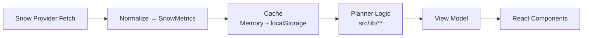

# Lift Architecture & Demo Distribution Guide

**Branch:** `v1-demo-truth` (or `demo-stable-1`)  
**Repo:** `git@github.com:darrenthopkins/ski-resort-snow-totals.git`

This document covers:

1. Stack / platform overview  
2. Data model & data flow  
3. Development workflows  
4. iOS distribution plan (demo-oriented)

---

# 1. Stack Overview

## High-Level Architecture

```mermaid
flowchart TD
    A[Application Code<br/>src/<br/>UI + Services + Planner]
    B[Vite Build Output<br/>HTML / CSS / JS]
    C[Web Runtime<br/>Browser (dev)<br/>WKWebView (iOS)]
    D[Capacitor Bridge]
    E[Native iOS Shell<br/>Swift + Xcode]

    A --> B
    B --> C
    C --> D
    D --> E
```

---

## Layer Responsibilities

### React
- Component-based UI architecture
- State management and rendering
- Lives entirely in `src/`

### Ionic React
- Mobile-optimized UI components (`IonPage`, `IonContent`, etc.)
- Navigation and routing patterns
- Renders to DOM (browser or WebView)

### Vite
- Fast dev server (`npm run dev`)
- Production bundler (`npm run build`)
- Outputs static web assets for Capacitor

### Capacitor
- Wraps web app inside native iOS container
- Hosts WKWebView
- Bridges JS ↔ native functionality

### Swift (iOS Shell)
- Native wrapper app
- AppDelegate, Info.plist, signing
- Built and distributed via Xcode

### Xcode
- Compiles native code
- Signs and installs app
- Produces TestFlight builds

---

## Runtime Matrix

| Layer | Browser | iOS Simulator | Physical Device |
|--------|----------|---------------|------------------|
| React + Ionic | ✅ | ✅ | ✅ |
| Snow Services | ✅ | ✅ | ✅ |
| Capacitor Bridge | ❌ | ✅ | ✅ |
| Swift / Native | ❌ | ✅ | ✅ |

---

# 2. Data Model & Data Flow

## Data Categories

### A. Dynamic Data (frequent updates)

Examples:
- Last 24–48 hour snowfall
- Next 24-hour forecast

Location:
- `src/services/snow/**`
- Shaped into view models in `src/lib/**`
- Rendered in `src/**`

Caching:
- Short TTL
- In-memory + `localStorage`

---

### B. Slower-Changing Data

Examples:
- Base depth
- Surface conditions

Location:
- Snow provider modules

Caching:
- Longer TTL (hours to daily)

---

### C. Static Data

Examples:
- Resort list
- Resort metadata (IDs, coordinates, regions)

Location:
- `src/lib/**` or `src/data/**`

Version-controlled and bundled with the app.

---

## Data Flow



---

# 3. Development Workflows

## A. Fastest Loop: Browser Development

```bash
npm install
npm run dev
```

Best for:
- UI iteration
- Planner logic
- Snow data modeling
- Rapid debugging

No native layer involved.

---

## B. Simulator (Production-Like Mode)

```bash
npm run build
npx cap sync ios
```

Then open Xcode and Run.

Best for:
- Demo rehearsal
- Confirming bundled asset behavior

---

## C. Physical Device

Same process as simulator but requires:
- Valid signing profile
- Trusted developer certificate

Always rehearse demo on the actual presentation device.

---

## D. ChatGPT Workflow Discipline

To keep threads efficient:

Include:
- Branch name
- Exact command
- Exact error output
- Relevant file snippet only

Avoid:
- Full log dumps
- Large diffs

Use targeted grep:
```bash
rg -n "error:|warning:" build.log
```

---

## E. Appflow (Optional Enhancement)

Appflow can provide:

- Cloud native builds
- Live Updates (web assets only)

Live Updates affect:
- HTML / CSS / JS  
Not native Swift code.

Not required for demo-day but useful post-demo.

---

# 4. iOS Distribution Plan (Demo-Oriented)

## Recommended: TestFlight (Internal Testing)

### Steps

1. Build production assets:

```bash
npm run build
npx cap sync ios
```

2. In Xcode:
   - Archive
   - Distribute
   - Upload to TestFlight

3. Add testers in App Store Connect
4. Share TestFlight link


**Status:** iOS build stable (Xcode 15.x / iOS 18 sim)  
**App Display Name:** Lift  
**Vitest excludes:** `vendor/**`, `.dd/**`

